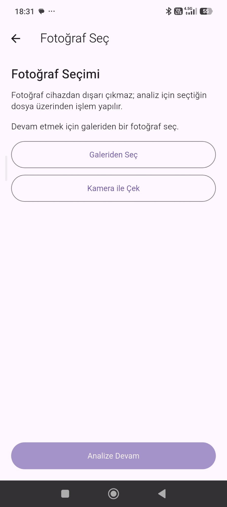
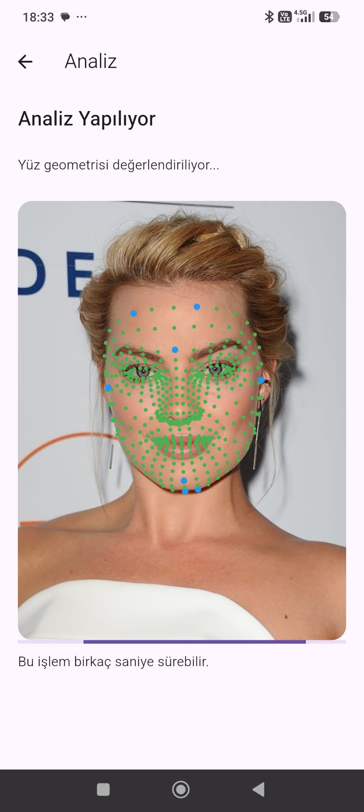

# Face Analysis and Style Guide (Work in Progress)

## Overview
This project is a mobile application that analyzes facial images to determine face shape and provide personalized hairstyle and eyeglass recommendations.

## Why This Project
This project was built to explore how facial geometry can be used to approximate style recommendations without relying on heavy machine learning models. It focuses on creating a lightweight, interpretable system using rule-based logic.

## Demo

### Home Screen

### Photo Guidelines

### Image Selection

### Face Analysis Process

### Results and Recommendations

## Features
- Face shape classification using rule-based geometric ratios (e.g., length/width, forehead proportions)
- Facial landmark-based analysis for extracting key measurements
- Personalized hairstyle and eyeglass recommendations based on detected face shape
- Mobile interface built with Flutter

## Current Status
Work in progress – currently improving calibration for more accurate face shape detection.

## Tech Stack
- Flutter
- Dart

## How It Works
The application analyzes facial proportions using rule-based geometric calculations. Key measurements such as face length, jaw width, and forehead width are compared to determine the face shape.

These proportions are mapped to predefined categories such as oval, round, and square. Based on the detected face shape, the system generates personalized hairstyle and eyeglass recommendations.

## Example Output

- Face Shape: Oval  
- Length/Width Ratio: ~1.24  
- Forehead Ratio: ~1.33  
- Generated Recommendations: Medium-length cuts, layered styles, side parting

## Challenges
- Calibrating face shape detection for different face proportions
- Ensuring consistent classification across varying image inputs
- Defining effective thresholds for rule-based classification

## Future Improvements
- Improve classification accuracy through better calibration
- Transition from rule-based system to machine learning approach
- Add real-time face detection using camera input

## What I Learned
- Designing rule-based systems for real-world approximation problems  
- Working with facial landmark-based geometric analysis  
- Building end-to-end mobile applications with user interaction and data processing

## Notes
- This project focuses on interpretability and lightweight computation rather than heavy machine learning models.

## Author
Mustafa Şahin
